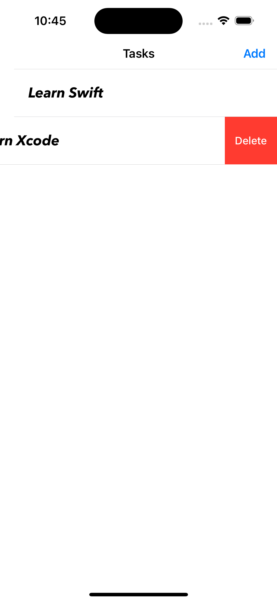
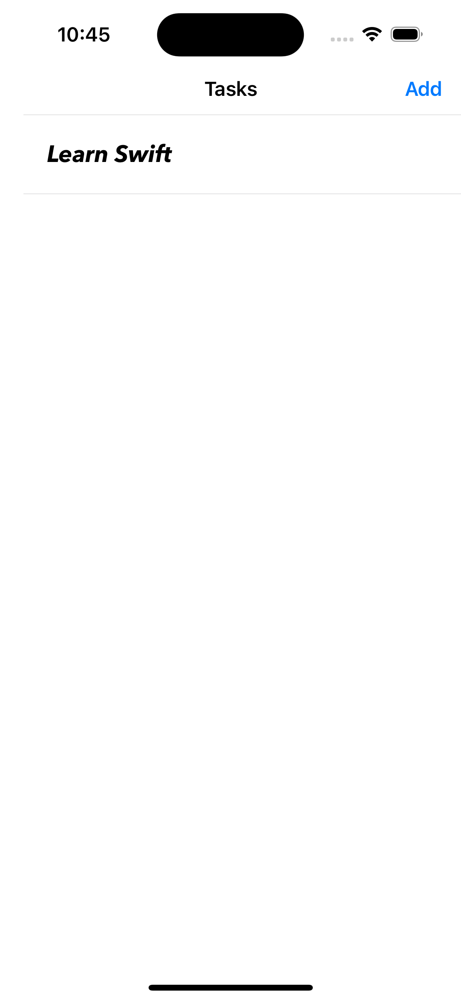
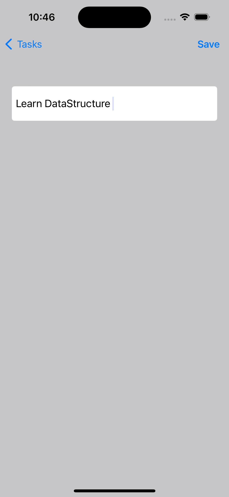
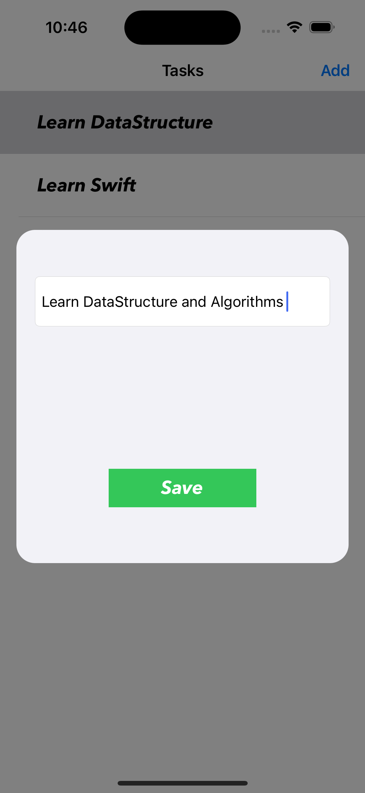
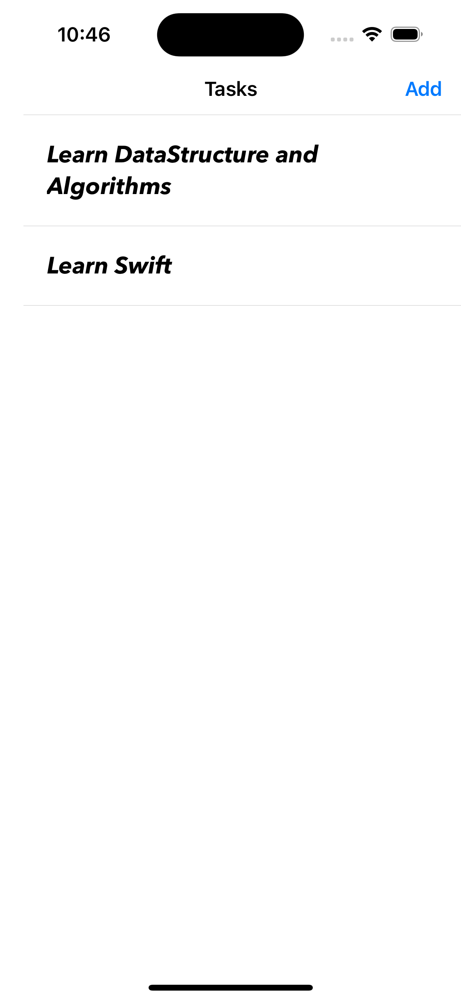

# 📝 ToDoList App

A simple and clean iOS To-Do List application built using **UIKit**, demonstrating key concepts in iOS development such as `UITableView`, `UserDefaults`, `closure-based data passing`, and screen navigation.

---

## 📱 Features

- ✅ Add new tasks via a dedicated screen.
- ✏️ Edit existing tasks using a popup interface.
- 🗑️ Delete tasks with swipe-to-delete.
- 💾 Tasks are saved persistently using `UserDefaults`.
- 🚀 Clean and minimal UI built with Storyboards and AutoLayout.
- 🔁 Real-time table updates on task changes using closures.

---

## 🧪 Screenshots

  
  
  
  
  
  

---

## 🧠 Technologies Used

- UIKit
- UITableView
- UserDefaults for persistence
- Storyboards
- NavigationController
- Closure-based data passing

---

---

## 📦 How to Run

1. Open the project in **Xcode**.
2. Connect an iPhone simulator or real device.
3. Build & run the app using `Cmd + R`.
4. Start adding, editing, and deleting tasks freely.

---

## 🚧 Future Improvements

- Add task completion status (✅ checkbox)
- Sort tasks alphabetically or by date
- Add date/time picker for scheduling tasks
- Enable local notifications for reminders
- Migrate storage from `UserDefaults` to `CoreData` or `Realm`

---

## 🙋‍♂️ Author

Made with ❤️ by [Beshoy Atef](https://github.com/Besho22A)

